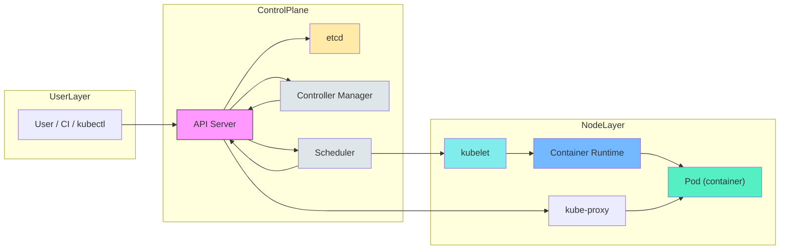

# Kubernetes Architecture & Workflow — Beginner-Friendly Guide for Architects

This note explains the Kubernetes control plane and node components, the request lifecycle (user → API → scheduler → kubelet → container), and includes a block diagram and a simple restaurant analogy to make the flow memorable.

---

## High-level components
- Control Plane: API Server, etcd, Controller Manager, Scheduler
- Nodes: kubelet, container runtime (containerd / Docker), kube-proxy, CNI plugin
- Workloads: Pods, ReplicaSets, Deployments, StatefulSets, Services

---

## Block diagram (workflow)


---

## Workflow explained step-by-step (simple)
1. User/CI sends a desired-state request (kubectl apply / CI pipeline) to the **API Server**.
2. **API Server** authenticates, validates, and persists the object in **etcd** (the source of truth).
3. Controllers (Controller Manager) watch the API and create/update resources to converge actual state to desired state.
4. The **Scheduler** assigns unscheduled Pods to specific Nodes based on resource needs and policies.
5. **kubelet** on the chosen Node receives the Pod spec (from API Server), pulls the image via the container runtime, and starts the container(s).
6. **kube-proxy** configures networking rules so Services route traffic to the Pod endpoints.
7. Controllers continue monitoring and reconciling (scaling, healing failed Pods) to maintain desired state.

Key notes:
- **etcd** stores the cluster state — it’s critical to back it up.
- The **API Server** is the gatekeeper; virtually every action goes through it.
- Controllers are declarative: they continuously reconcile actual state toward desired state.

---

## Component responsibilities (short table)

- API Server: receive requests, validation, authentication, admission webhooks.
- etcd: persistent key-value store for cluster state.
- Controller Manager: runs controllers (replication, endpoints, node controller).
- Scheduler: places pods onto nodes.
- kubelet: agent on node; ensures containers from PodSpecs are running.
- Container Runtime: pulls images and runs containers (containerd, Docker).
- kube-proxy: implements Service networking (iptables/ipvs or userspace).

---

## Restaurant analogy (easy-to-remember)
Map Kubernetes to a restaurant kitchen to visualize responsibilities and workflow:

- Customer / Waiter → User / kubectl / CI: customer places an order (desired state).
- Host/Order board → API Server: receives and records the order.
- Recipe book → etcd: canonical recipes (persisted desired state).
- Head Chef → Controller Manager: ensures each dish is prepared according to recipes; reassigns tasks if needed.
- Line Manager → Scheduler: assigns each dish to a station (grill, fryer) based on capacity.
- Station Cook → kubelet: executes the cooking (runs containers) on assigned station (node).
- Stove/Oven → Container Runtime: actual tool that runs the process.
- Runner / Waitstaff → kube-proxy / Service: routes finished dishes to correct tables.

Why this helps:
- If a station is full, the line manager (scheduler) moves the order to another station.
- If a dish fails, the head chef (controller) asks the station cook to retry or replace the dish.

---

## Additional important points for CKA

### Admission Controllers (often missed by beginners)
- After API Server authenticates and authorizes a request, it passes through **admission controllers**.
- Admission controllers can **mutate** (modify) or **validate** (accept/reject) requests before they are persisted in etcd.
- Examples: `NamespaceLifecycle`, `LimitRanger`, `ResourceQuota`, `DefaultStorageClass`, `MutatingAdmissionWebhook`, `ValidatingAdmissionWebhook`.
- You can list enabled admission controllers with:
  ```bash
  kubectl -n kube-system describe pod kube-apiserver-<node> | grep enable-admission
  ```

### What happens when a component fails?

| Component Down | Impact |
|---------------|--------|
| API Server | kubectl stops working, no new deployments, existing pods keep running |
| etcd | API Server can't read/write state, cluster effectively frozen |
| Scheduler | New pods stay in `Pending` state, existing pods unaffected |
| Controller Manager | No auto-healing, no scaling, desired state not enforced |
| kubelet | Node marked `NotReady` after timeout, pods on that node orphaned |
| kube-proxy | Service networking breaks on that node, pods still run |

### High Availability (HA) control plane

**Why HA?** In a single-control-plane cluster, if the control plane node goes down, the entire cluster stops responding — workloads keep running but nothing new can be scheduled or changed.

**HA goal:** Run multiple control plane nodes so that if one fails, the others continue serving the cluster.

#### Quorum rule (etcd Raft consensus)
| Control plane nodes | etcd nodes | Failures tolerated |
|---|---|---|
| 1 | 1 | 0 |
| 3 | 3 | 1 |
| 5 | 5 | 2 |

**Rule of thumb:** Always use an **odd number** (3 or 5) so a majority can always be reached.

#### Component behavior in HA
| Component | Mode | How |
|---|---|---|
| kube-apiserver | **Active-Active** | All nodes serve requests; a load balancer distributes traffic |
| kube-controller-manager | **Active-Passive** | One leader at a time; elected via `--leader-elect=true` |
| kube-scheduler | **Active-Passive** | Same leader-election mechanism |
| etcd | **Active-Active** (consensus) | All etcd peers participate; writes need quorum |

#### Two HA topologies

**1. Stacked etcd (most common):**
```
┌─────────────────────────────────────────────────────────┐
│                   Load Balancer                         │
│              (e.g., HAProxy / kube-vip)                 │
└──────────┬────────────────┬───────────────┬─────────────┘
           │                │               │
    ┌──────▼──────┐  ┌──────▼──────┐  ┌────▼────────┐
    │ control-1   │  │ control-2   │  │ control-3   │
    │ apiserver   │  │ apiserver   │  │ apiserver   │
    │ controller  │  │ controller  │  │ controller  │
    │ scheduler   │  │ scheduler   │  │ scheduler   │
    │  [etcd]     │  │  [etcd]     │  │  [etcd]     │
    └─────────────┘  └─────────────┘  └─────────────┘
```
etcd runs **on the same node** as the control plane components. Simpler to manage, fewer machines needed. Used in Killercoda and most kubeadm clusters.

**2. External etcd (production-critical):**
```
┌─────────────────────────────────────────────────────────┐
│                   Load Balancer                         │
└──────────┬────────────────┬───────────────┬─────────────┘
           │                │               │
    ┌──────▼──────┐  ┌──────▼──────┐  ┌────▼────────┐
    │ control-1   │  │ control-2   │  │ control-3   │
    │ apiserver   │  │ apiserver   │  │ apiserver   │
    │ controller  │  │ controller  │  │ controller  │
    │ scheduler   │  │ scheduler   │  │ scheduler   │
    └──────┬──────┘  └──────┬──────┘  └────┬────────┘
           └────────────────┴───────────────┘
                            │
    ┌───────────────────────▼─────────────────────────┐
    │       External etcd cluster (3 nodes)           │
    │    etcd-1     etcd-2     etcd-3                 │
    └─────────────────────────────────────────────────┘
```
etcd runs on **separate dedicated nodes**. More resilient (a control plane crash doesn't risk etcd data), but requires more machines.

#### Setting up HA with kubeadm

```bash
# On the FIRST control plane node — set --control-plane-endpoint to the load balancer IP/hostname
sudo kubeadm init \
  --control-plane-endpoint="LOAD_BALANCER_IP:6443" \
  --upload-certs \
  --pod-network-cidr=192.168.0.0/16

# Output will print TWO join commands:
# 1. For additional control plane nodes (includes --control-plane flag)
# 2. For worker nodes (normal join)

# On SECOND and THIRD control plane nodes — use the control-plane join command
sudo kubeadm join LOAD_BALANCER_IP:6443 \
  --token <token> \
  --discovery-token-ca-cert-hash sha256:<hash> \
  --control-plane \
  --certificate-key <cert-key>

# Each new control plane node needs the kubeconfig too
mkdir -p $HOME/.kube
sudo cp -i /etc/kubernetes/admin.conf $HOME/.kube/config
sudo chown $(id -u):$(id -g) $HOME/.kube/config

# Verify — should see multiple control plane nodes
kubectl get nodes
# NAME           STATUS   ROLES           AGE
# control-1      Ready    control-plane   10m
# control-2      Ready    control-plane   5m
# control-3      Ready    control-plane   2m
# worker-1       Ready    <none>          8m
```

#### kube-vip — lightweight HA load balancer (popular with kubeadm)

kube-vip provides a **virtual IP (VIP)** that floats between control plane nodes. No external hardware load balancer needed.

```bash
# Install kube-vip as a static pod (run BEFORE kubeadm init)
# Generate the static pod manifest
export VIP=192.168.1.100    # choose a free IP in your network
export INTERFACE=eth0        # your network interface name

kubectl apply -f https://kube-vip.io/manifests/rbac.yaml

ctr images pull ghcr.io/kube-vip/kube-vip:latest

ctr run --rm --net-host ghcr.io/kube-vip/kube-vip:latest vip /kube-vip \
  manifest pod \
  --interface $INTERFACE \
  --address $VIP \
  --controlplane \
  --services \
  --arp \
  --leaderElection | tee /etc/kubernetes/manifests/kube-vip.yaml

# Then run kubeadm init pointing to the VIP
sudo kubeadm init \
  --control-plane-endpoint="$VIP:6443" \
  --upload-certs \
  --pod-network-cidr=192.168.0.0/16
```

#### Verify HA health
```bash
# Check all control plane nodes
kubectl get nodes -l node-role.kubernetes.io/control-plane

# Check etcd cluster health (run on a control plane node)
ETCDCTL_API=3 etcdctl \
  --endpoints=https://127.0.0.1:2379 \
  --cacert=/etc/kubernetes/pki/etcd/ca.crt \
  --cert=/etc/kubernetes/pki/etcd/server.crt \
  --key=/etc/kubernetes/pki/etcd/server.key \
  endpoint health --cluster

# Expected output:
# https://192.168.1.10:2379 is healthy: ...
# https://192.168.1.11:2379 is healthy: ...
# https://192.168.1.12:2379 is healthy: ...

# Check etcd member list
ETCDCTL_API=3 etcdctl \
  --endpoints=https://127.0.0.1:2379 \
  --cacert=/etc/kubernetes/pki/etcd/ca.crt \
  --cert=/etc/kubernetes/pki/etcd/server.crt \
  --key=/etc/kubernetes/pki/etcd/server.key \
  member list

# Check leader-election for scheduler and controller-manager
kubectl get endpoints -n kube-system kube-scheduler -o yaml | grep "control-plane.alpha.kubernetes.io/leader"
kubectl get endpoints -n kube-system kube-controller-manager -o yaml | grep "control-plane.alpha.kubernetes.io/leader"

# Check component health
kubectl get componentstatuses
```

#### CKA exam tip — HA concepts you must know
- Difference between **stacked etcd** and **external etcd** topology
- `--control-plane-endpoint` flag is required for HA setup (cannot add HA later without this)
- `--upload-certs` shares certificate keys between control plane nodes automatically
- etcd quorum formula: **majority = (n/2) + 1** — with 3 nodes, 2 must agree
- The load balancer is just a TCP passthrough to port 6443 (not TLS termination)

### CNI (Container Network Interface) — the networking plugin
- CNI plugin provides pod-to-pod networking across nodes.
- Without CNI, pods on different nodes cannot communicate.
- Popular CNI plugins: **Calico**, **Flannel**, **Cilium**, **Weave Net**.
- CNI is installed AFTER `kubeadm init` — that's why CoreDNS pods stay `Pending` until CNI is deployed.
- Each CNI has its own pod CIDR requirements (e.g., Calico uses `192.168.0.0/16` by default).

### RBAC (Role-Based Access Control) — who can do what
- RBAC controls access to Kubernetes API resources.
- Four objects: `Role`, `ClusterRole`, `RoleBinding`, `ClusterRoleBinding`.
- `Role`/`RoleBinding` = namespace-scoped permissions.
- `ClusterRole`/`ClusterRoleBinding` = cluster-wide permissions.
- Quick example:
  ```bash
  # Check who can create pods
  kubectl auth can-i create pods --as=system:serviceaccount:default:my-sa
  ```

### etcd backup and restore (CKA exam critical)
```bash
# Backup etcd
ETCDCTL_API=3 etcdctl snapshot save /tmp/etcd-backup.db \
  --endpoints=https://127.0.0.1:2379 \
  --cacert=/etc/kubernetes/pki/etcd/ca.crt \
  --cert=/etc/kubernetes/pki/etcd/server.crt \
  --key=/etc/kubernetes/pki/etcd/server.key

# Verify backup
ETCDCTL_API=3 etcdctl snapshot status /tmp/etcd-backup.db --write-table

# Restore etcd (stop API server first)
ETCDCTL_API=3 etcdctl snapshot restore /tmp/etcd-backup.db \
  --data-dir=/var/lib/etcd-restored
```

### Key ports to remember

| Component | Port | Purpose |
|-----------|------|---------|
| API Server | 6443 | HTTPS API endpoint |
| etcd | 2379 | Client requests |
| etcd | 2380 | Peer communication |
| kubelet | 10250 | API (authenticated) |
| kube-proxy | 10256 | Health check |
| Scheduler | 10259 | HTTPS health |
| Controller Manager | 10257 | HTTPS health |

### Quick troubleshooting flow
```
Pod not running?
  └─ kubectl describe pod <name> → check Events section
  └─ kubectl logs <pod-name> → check container logs
  └─ kubectl get events --sort-by='.lastTimestamp' → cluster events
  └─ kubectl get nodes → check node status
  └─ systemctl status kubelet → on the node itself
```
- The recipe book (etcd) is the single source of truth — lose it and confusion arises.

---

## Architecture decisions for architects (concise)
- High availability: run multiple API Server replicas behind a load balancer; etcd should be clustered with odd members.
- Performance: schedule placement (binpack vs spread) affects utilization and latency.
- Security: API authentication/authorization, network policies, RBAC.
- Observability: metrics from API, kubelet, controller-manager, logs, and distributed tracing for request flows.

---

## Quick comparisons and patterns

- Control Plane vs Node: control plane decides and stores; nodes execute.
- Declarative controllers: controllers are event-driven loops that reconcile desired vs actual state.

Pattern examples:
- Blue-green / Rolling updates: handled by Deployments (control-plane orchestrates gradual replacements).
- Stateful workloads: StatefulSet provides stable identities and storage, but requires thought on scaling/backup.
